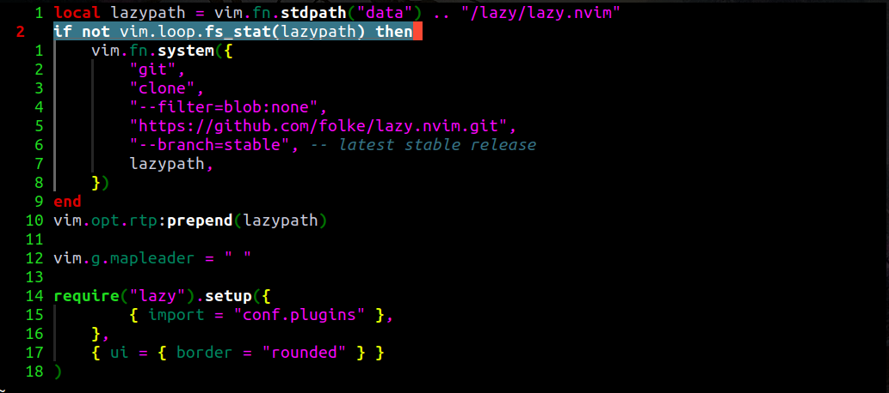

# Oldschool.nvim

A simple, minimal, oldschool dark theme for Neovim. It features a fully black background and vibrant, high-contrast colors.

## Installation

### Using `lazy.nvim`

You can install using `lazy.nvim` by simply adding to your configuration file(s):

```lua
{
    "L-Colombo/oldschool.nvim"
}
```


## Lualine

To use `Oldschool.nvim` with [lualine.nvim](https://github.com/nvim-lualine/lualine.nvim) just set the theme option either to `auto` or `oldschool`.

## Gallery

### Haskell


### Rust


### Lua

